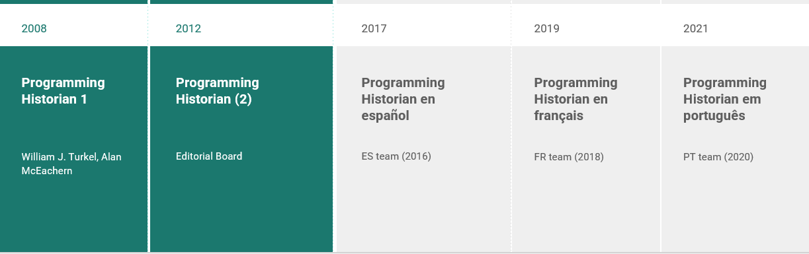
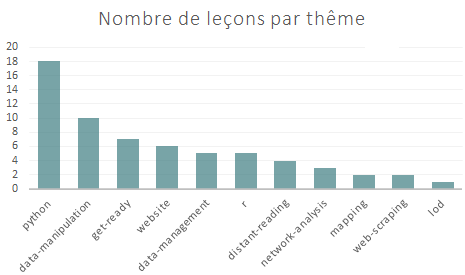

# Le programming historian { data-background-size="1000px" data-background-color="white"}


<p class=smallpcenter" style="margin-top:80px;font-size:85%;"> Une collection évolutive de tutoriels appliqués à l'histoire et aux Shs </p>  


## Une revue ouverte et libre

<p class="medpcenter" style="margin-top:60px;margin-bottom:0px;">
<ul>
<li> **Accès ouvert Diamand** (CC BY licence) </li>
<li> Revue par les pairs </li>
<li> Cycle d'édition ouvert </li>
</ul></p>

## Histoire 


## Une encyclopdie technique mutli-lingues

* 4 chapitres : EN / ES / FR / PT
* 188 leçons 141 originales
* aujourd'hui NB leçons : 89 en anglais / 55 espagnoles / 21 leçons en français / 23 leçons en portugais
* Apprendre à utiliser python, R, à manipuler des données, les publier <br>& Analyse : de réseaux, de cartes


## Une revue contributive

<p class="medpcenter" style="margin-top:60px;margin-bottom:0px;">
<ul>
<li> 300 contributeurs depuis 2008 </li>
<li> Basée sur le volontariat </li>
<li> Ecritures pluridisciplinaires </li>
<li> Fabrique d'outils pédagogiques mise à disposition du commun </li>
</ul></p>

## Valeurs d'ouvertures 

<p class="medpcenter" style="margin-top:60px;margin-bottom:0px;"> Construit par des ensembles de communautés : 
<ul>
<li> Linguistique </li>
<li> Culturelle </li>
<li> Disciplinaire </li>
</ul></p>

# Cycle d'édition


# Des contributions

## Contributions éditoriales


```{r, echo=FALSE, eval=TRUE}


```  
  
